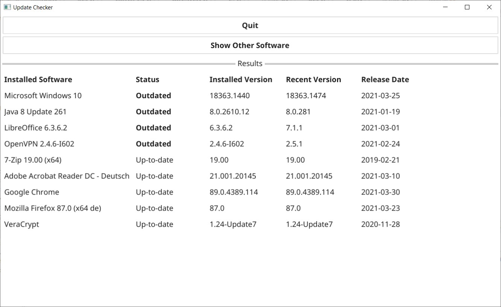

# UpdateChecker Overview

Checks for software release states on Windows systems.

Only finds software installed via regular Windows Installer (no "portable" software)!

UpdateChecker is using https://vergrabber.kingu.pl/ to fetch the current versions of the supported softwares.

Currently supported are:
* Windows 10 client
* Mozilla Firefox
* Google Chrome
* OpenVPN
* Adobe Flash Player
* Adobe Acrobat Reader
* 7-Zip
* TeamViewer
* Mozilla Thunderbird
* VeraCrypt
* Java 8
* LibreOffice

UpdateChecker is Open Source (GPL 3.0), doesn't track you and is ad-free. The only online connection goes to https://vergrabber.kingu.pl/ to fetch the software release JSON file.

# Installation
Just unzip the provided ZIP-File to a location that fits your needs.

The UpdateChecker directory contains the following files and directories:
* UpdateChecker.exe: The executable

Only there after first start of UpdateChecker.exe:
* vergrabber.json: This is a json file that contains the current version of the software packages. Will be updated when UpdateChecker.exe is started, but only once a day (if started more than once a day this cached version is used)
* UpdateChecker.log: Log output, check for errors if something doesn't work as expected or no Webpage is opened in your browser

# Usage
Just start UpdateChecker.exe (you don't need administrative rights) and wait some seconds. UpdateChecker fetches the current software versions from https://vergrabber.kingu.pl/ and thereafter verifies your installed software and then shows the results.

The column "Status" shows you the state of the listed software installation:
* Outdated: Updates are available. It is recommended to install the recent version to be sure you have the latest security patches applied.
* Up-to-date: The most recent version is installed.

You can use the button "Show Other Software" to take a look at all other installed software versions (not verified / supported by Update Checker).
